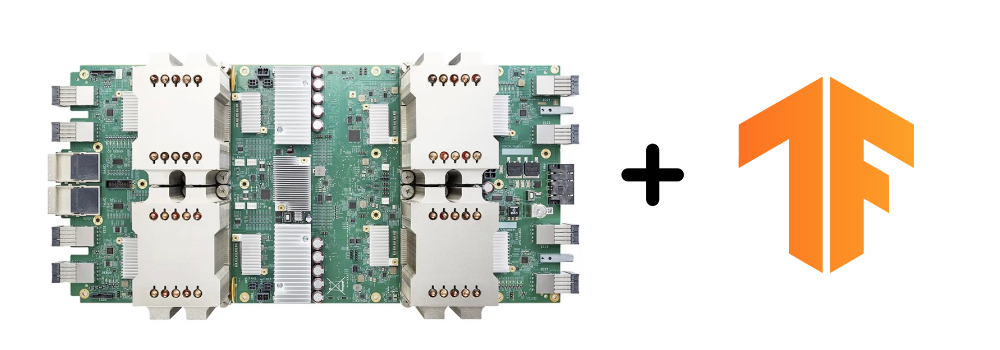
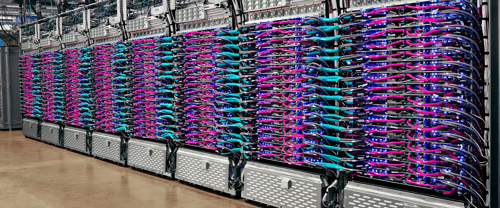
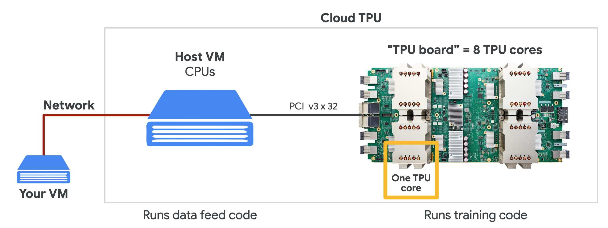

# 使用 TPU 训练 TensorFlow 模型（Huan）



2017年5月，Alpha Go 在中国乌镇围棋峰会上，与世界第一棋士柯洁比试，并取得了三比零全胜战绩。之后的版本Alpha Zero可以通过自我学习21天即可以达到胜过中国顶尖棋手柯洁的Alpha Go Master的水平。

Alpha Go 背后的动力全部由 TPU 提供。TPU 使其能够更快地“思考”并在每一步之间看得更远。

## 什么是 TPU

TPU 代表 Tensor Processing Unit (张量处理单元) ，是由谷歌在2016年5月发布的为机器学习而构建的定制集成电路（ASIC），并为TensorFlow量身定制。

早在2015年，谷歌大脑团队就成立了第一个TPU中心，为 Google Translation，Photos 和 Gmail等产品提供支持。 为了使所有数据科学家和开发人员能够访问此技术，不久之后就发布了易于使用，可扩展且功能强大的基于云的TPU，以便在 Google Cloud 上运行 TensorFlow 模型。

TPU 由多个计算核心（Tensor Core）组成，其中包括标量，矢量和矩阵单元（MXU）。TPU（张量处理单元）与CPU（中央处理单元）和GPU（图形处理单元）最重要的区别是：TPU的硬件专为线性代数而设计，线性代数是深度学习的基石。在过去几年中，Google TPU 已经发布了 v1，v2，v3, v2 Pod, v3 Pod, Edge 等多个版本：

<table border="0">
  <tr>
    <td>版本</td>
    <td>图片</td>
    <td>性能</td>
    <td>内存</td>
  </tr>
  <tr>
    <td>TPU<br />(v1, 2015)</td>
    <td><image src="images/tpu-v1.png" border="0" width="100"></td>
    <td>92 TeraFLOPS</td>
    <td>8 GB HBM</td>
  </tr>
  <tr>
    <td>Cloud TPU<br />(v2, 2017)</td>
    <td><image src="images/tpu-v2.jpg" border="0" width="100"></td>
    <td>180 TeraFLOPS</td>
    <td>64 GB HBM</td>
  </tr>
  <tr>
    <td>Cloud TPU<br />(v3, 2018)</td>
    <td><image src="images/tpu-v3.png" border="0" width="100"></td>
    <td>420 TeraFLOPS</td>
    <td>128 GB HBM</td>
  </tr>

  <tr>
    <td><nobr>Cloud TPU Pod</nobr><br />(v2, 2017)</td>
    <td><image src="images/tpu-v2-pod.png" border="0" width="100"></td>
    <td>11,500 TeraFLOPS</td>
    <td>4,096 GB HBM</td>
  </tr>
  <tr>
    <td>Cloud TPU Pod<br />(v3, 2018)</td>
    <td><image src="images/tpu-v3-pod.jpg" border="0" width="100"></td>
    <td><nobr>100,000+ TeraFLOPS</nobr></td>
    <td><nobr>32,768 GB HBM</nobr></td>
  </tr>

  <tr>
    <td>Edge TPU<br />(Coral, 2019)</td>
    <td><image src="images/tpu-edge-coral-usb.png" border="0" width="100"></td>
    <td>4 TeraOPS</td>
    <td></td>
  </tr>
</table>

> 注：
>
> 1. Tera: 万亿，10的12次方
> 1. Peta: 千万亿，10的15次方
> 1. FLOPS：每秒浮点数计算次数（FLoating-point Operations Per Second）
> 1. OPS: 每秒位整数计算次数（Integer Operations Per Second）

基于 Google Cloud，TPU 可以方便的进行建立和使用。同时，Google 也推出了专门为边缘计算环境而部署的 Edge TPU。Edge TPU 尺寸小，功耗低，性能高，可以在边缘计算环境中广泛部署高质量的AI。其作为 Cloud TPU 的补充，可以大大促进AI的解决方案在IoT环境中的部署。

## 为什么使用 TPU

通过使用 Cloud TPU ，我们可以大大提升 TensorFlow 进行机器学习训练和预测的性能，并能够灵活的帮助研究人员，开发人员和企业 TensorFlow 计算群集。



根据 Google 提供的数据显示，在 Google Cloud TPU Pod 上可以仅用 8 分钟就能够完成ResNet-50 模型的训练。

| ResNet-50 | TPU | TPU Pod |
| --- | --- | --- |
| 训练速度（每秒图像数） | 4000+ | 200,000+ |
| 最终精度 | 93% | 93% |
| 训练时长 | 7h 47m | 8m 45s |

> Source: Google

## TPU 性能

根据研究显示，TPU 比现代 GPU 和 CPU 快 15 到 30 倍。同时，TPU 还实现了比传统芯片更好的能耗效率，算力能耗比值提高了30倍至80倍。

每个周期的操作次数：

| | 每周期计算次数 |
| --- | --- |
| CPU | 10 |
| GPU | 10000 |
| TPU | 100000 |

每瓦性能比：

| | 每瓦性能比 |
| --- | --- |
| CPU | 1 |
| GPU | 2.9 |
| TPU | 83 |

每秒推理次数：

| | 每秒推理次数 |
| --- | --- |
| CPU | 5,482 |
| GPU | 13,194 |
| TPU | 225,000 |

Source: [An in-depth look at Google’s first Tensor Processing Unit (TPU)](https://cloud.google.com/blog/products/gcp/an-in-depth-look-at-googles-first-tensor-processing-unit-tpu)

## 免费 TPU：Google Colab

最方便使用 TPU 的方法，就是使用 Google 的 Colab ，不但通过浏览器访问直接可以用，而且还免费。

在 [Google Colab](https://colab.research.google.com) 的 Notebook 界面中，打开界面中，打开主菜单 Runtime ，然后选择 Change runtime type，会弹出 Notebook settings 的窗口。选择里面的 Hardware accelerator 为 TPU 就可以了。

为了确认 Colab Notebook 中的确分配了 TPU 资源，我们可以运行以下测试代码。

1. 如果输出 ERROR 信息，则表示目前的 Runetime 并没有分配到 TPU；
1. 如果输出 TPU 地址及设备列表，则表示 Colab 已经分配了 TPU；

```python
import os
import pprint
import tensorflow as tf

if 'COLAB_TPU_ADDR' not in os.environ:
  print('ERROR: Not connected to a TPU runtime')
else:
  tpu_address = 'grpc://' + os.environ['COLAB_TPU_ADDR']
  print ('TPU address is', tpu_address)

  with tf.Session(tpu_address) as session:
    devices = session.list_devices()

  print('TPU devices:')
  pprint.pprint(devices)
```

输出信息：

```text
TPU address is grpc://10.49.237.2:8470
TPU devices:
[_DeviceAttributes(/job:tpu_worker/.../device:CPU:0, CPU, ...),
 _DeviceAttributes(/job:tpu_worker/.../device:XLA_CPU:0, XLA_CPU, ...),
 _DeviceAttributes(/job:tpu_worker/.../device:TPU:0, TPU, ...),
 _DeviceAttributes(/job:tpu_worker/.../device:TPU:1, TPU, ...),
 _DeviceAttributes(/job:tpu_worker/.../device:TPU:2, TPU, ...),
 _DeviceAttributes(/job:tpu_worker/.../device:TPU:3, TPU, ...),
 _DeviceAttributes(/job:tpu_worker/.../device:TPU:4, TPU, ...),
 _DeviceAttributes(/job:tpu_worker/.../device:TPU:5, TPU, ...),
 _DeviceAttributes(/job:tpu_worker/.../device:TPU:6, TPU, ...),
 _DeviceAttributes(/job:tpu_worker/.../device:TPU:7, TPU, ...),
 _DeviceAttributes(/job:tpu_worker/.../device:TPU_SYSTEM:0, TPU_SYSTEM, ...)]
```

## Cloud TPU

在 Google Cloud 上，我们可以购买所需的 TPU 资源，用来按需进行机器学习训练。为了使用 Cloud TPU ，需要在 Google Cloud Engine 中启动 VM 并为 VM 请求 Cloud TPU 资源。请求完成后，VM 就可以直接访问分配给它专属的 Cloud TPU了。


> Source: [TPUs for Developers](https://docs.google.com/presentation/d/1iodAZkOX0YMnUwohgQqNsbEkhR0zAnO-jncK9SkJ69o/edit#slide=id.g4461849552_8_3664)

在使用 Cloud TPU 时，为了免除繁琐的驱动安装，我们可以通过直接使用 Google Cloud 提供的 VM 操作系统镜像。

## 使用 TPU

在 TPU 上进行 TensorFlow 分布式训练的核心API是`tf.distribute.TPUStrategy`，可以简单几行代码就实现在 TPU 上的分布式训练，同时也可以很容易的迁移到 GPU单机多卡、多机多卡的环境。以下是如何实例化 `TPUStrategy`：

```python
resolver = tf.contrib.cluster_resolver.TPUClusterResolver(tpu='grpc://' + os.environ['COLAB_TPU_ADDR'])
tf.tpu.experimental.initialize_tpu_system(resolver)
strategy = tf.distribute.experimental.TPUStrategy(resolver)
```

在上面的代码中，首先我们通过 `TPUClusterResolver` 用来获得 TPU 的参数（IP和端口），然后，我们对其进行初始化，并在最终通过 `TPUStrategy` 实例化到指定的 TPU 上。

## Fashion MNIST 分类例子

本小节的源代码可以在 <https://github.com/huan/tensorflow-handbook-tpu> 找到。

更方便的是在 Google Colab 上直接打开本例子的 Jupyter 直接运行，地址：<https://colab.research.google.com/github/huan/tensorflow-handbook-tpu/blob/master/tensorflow-handbook-tpu-example.ipynb>（推荐）

```python
import tensorflow as tf
import numpy as np

(x_train, y_train), (x_test, y_test) = tf.keras.datasets.fashion_mnist.load_data()

# add empty color dimension
x_train = np.expand_dims(x_train, -1)
x_test = np.expand_dims(x_test, -1)

def create_model():
  model = tf.keras.models.Sequential()

  model.add(tf.keras.layers.Conv2D(128, (3, 3), input_shape=x_train.shape[1:]))
  model.add(tf.keras.layers.MaxPooling2D(pool_size=(2, 2), strides=(2,2)))
  model.add(tf.keras.layers.Activation('elu'))

  model.add(tf.keras.layers.Flatten())
  model.add(tf.keras.layers.Dense(10))
  model.add(tf.keras.layers.Activation('softmax'))
  
  return model

import os

resolver = tf.contrib.cluster_resolver.TPUClusterResolver(tpu='grpc://' + os.environ['COLAB_TPU_ADDR'])
tf.tpu.experimental.initialize_tpu_system(resolver)
strategy = tf.distribute.experimental.TPUStrategy(resolver)

with strategy.scope():
  model = create_model()
  model.compile(
    optimizer=tf.keras.optimizers.Adam(learning_rate=1e-3),
    loss=tf.keras.losses.sparse_categorical_crossentropy,
    metrics=[tf.keras.metrics.sparse_categorical_accuracy])

model.fit(
  x_train.astype(np.float32), y_train.astype(np.float32),
  epochs=5,
  steps_per_epoch=60,
  validation_data=(x_test.astype(np.float32), y_test.astype(np.float32)),
  validation_freq=5
)
```

以上程序运行输出为：

```shell
Epoch 1/5
60/60 [==========] - 1s 23ms/step - loss: 12.7235 - accuracy: 0.7156
Epoch 2/5
60/60 [==========] - 1s 11ms/step - loss: 0.7600 - accuracy: 0.8598
Epoch 3/5
60/60 [==========] - 1s 11ms/step - loss: 0.4443 - accuracy: 0.8830
Epoch 4/5
60/60 [==========] - 1s 11ms/step - loss: 0.3401 - accuracy: 0.8972
Epoch 5/5
60/60 [==========] - 4s 60ms/step - loss: 0.2867 - accuracy: 0.9072

10/10 [==========] - 2s 158ms/step
10/10 [==========] - 2s 158ms/step
val_loss: 0.3893 - val_sparse_categorical_accuracy: 0.8848
```
